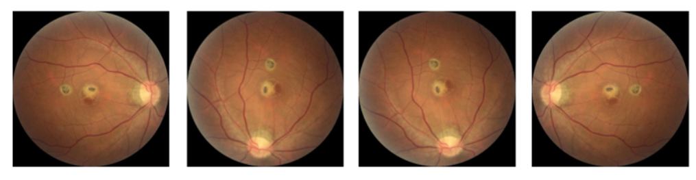
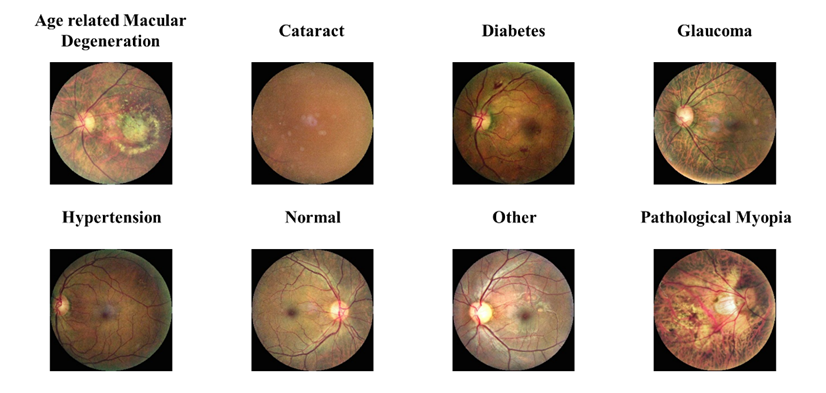
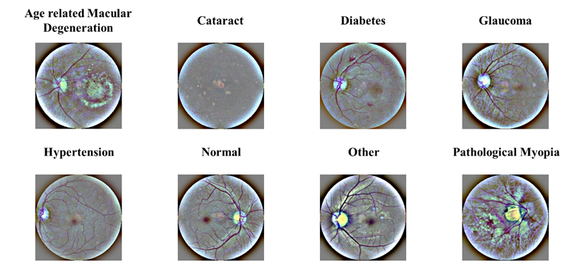
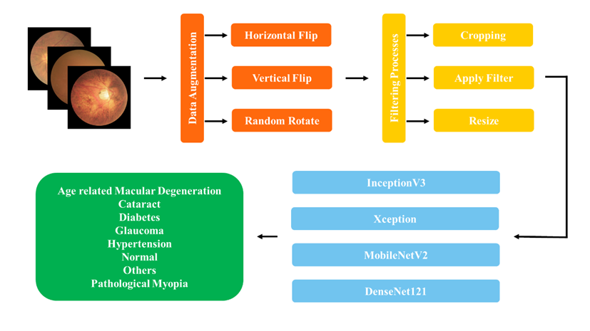

# FundAi
**FundAi** is a deep learning project designed to classify various eye diseases using retinal fundus images. The primary goal is to compare the performance of different Convolutional Neural Network (CNN) architectures on a medical imaging classification task using CNN models such as DenseNet121, InceptionV3, MobileNetV2, and Xception. This comparison aims to identify the most effective model for assisting in automated diagnosis of common ocular conditions.

---

## 📁 Project Structure

```
FundAI/
│
├── config/
│ └── config.ini # Configuration file for training parameters
│
├── data/ # Dataset folder (ODIR dataset expected)
│
├── src/
│ ├── ben_graham_preprocessing.py # Gaussian filtering-based image preprocessing
│ ├── callbacks.py # EarlyStopping and ReduceLROnPlateau
│ ├── clahe_filter.py # CLAHE (contrast limited adaptive histogram equalization)
│ ├── config.py # Loads and parses config.ini
│ ├── data_augmentation.py # Augmentation techniques (flip, rotate, etc.)
│ ├── data_loader.py # Loads dataset and prepares it for training
│ ├── evaluation.py # Evaluates model performance
│ ├── main.py # Main entry point for training
│ ├── model_builder.py # CNN model creation
│ └── set_seed.py # Reproducibility setup
│
├── .gitignore
└── README.md
```

---

## 🧠 Dataset

The **FundAi** project utilizes the [ODIR Dataset](https://odir2019.grand-challenge.org/Download/) — a publicly available collection of fundus images labeled with multiple ocular diseases.

The dataset contains retinal fundus images associated with various eye conditions. Each image can belong to one or more of the following classes. The number of images for each class is listed below:

| Class Name                | Number of Images |
|--------------------------|------------------|
| Age-related Macular Degeneration | 266              |
| Cataract                 | 293              |
| Diabetes                 | 1608             |
| Glaucoma                 | 284              |
| Hypertension             | 128              |
| Normal                   | 2873             |
| Others                   | 708              |
| Pathological Myopia      | 232              |
| Total | 6392 |

---

## 📊 Data Augmentation

The following data augmentation techniques are applied to increase the robustness and generalization of the model:

- **Horizontal Flip**: Randomly flips the image horizontally.
- **Vertical Flip**: Randomly flips the image vertically.
- **Random Rotation**: Rotates the image by a random degree within a predefined range.

These augmentations are implemented in the `src/data_augmentation.py` script.


---

## 🧹 Preprocessing

To improve image quality and emphasize relevant features, the following preprocessing techniques are applied:

- **CLAHE (Contrast Limited Adaptive Histogram Equalization)**  
  Enhances local contrast to make features more distinguishable. Implemented in `src/clahe_filter.py`.



- **Gaussian Filtering (Ben Graham method)**  
  Applies a Gaussian blur to the image for noise reduction and to mimic retinal vessel visibility. Implemented in `src/ben_graham_preprocessing.py`.



- **Image Cropping and Resizing**  
  Removes unnecessary borders and resizes the image to a fixed shape (e.g., 224x224) suitable for CNN input.

These preprocessing steps are applied during data loading in combination with augmentation, primarily in the `src/data_loader.py` file.

---

## 🎨 Pipeline

To achieve this, the project implements a modular pipeline consisting of:

- Data augmentation techniques (e.g., flipping, rotation),
- Image preprocessing and enhancement (e.g., cropping, resizing, CLAHE),
- Model training and evaluation with multiple CNN architectures.



---

## 🧪 Training Pipeline

The pipeline follows these modular stages:

1. **Configuration** – Parameters set via `config/config.ini`
2. **Data Preprocessing** – Cropping, resizing, CLAHE, and Ben Graham filtering
3. **Data Augmentation** – Random transformations to prevent overfitting
4. **Model Building** – Training with CNN models from `model_builder.py`
5. **Evaluation** – Metrics and comparison of model performance

---

## 📈 Results

The results of this study can be interpreted from two primary perspectives: the impact of image preprocessing filters on classification performance, and the effect of dataset balancing on model accuracy.

### 🔍 Effect of Image Preprocessing Filters

Two different preprocessing filters were evaluated during the experiments:

- **CLAHE Filter** significantly improved the classification performance for the *Cataract* class.  
- **Ben Graham Filter**, on the other hand, led to notable performance improvements across multiple classes, especially for *Pathological Myopia*.

These observations underscore the importance of selecting appropriate preprocessing techniques to enhance model sensitivity to specific disease-related features in fundus images.

### 🔁 Impact of Data Balancing and Augmentation

To address class imbalance in the ODIR dataset, which contains 6,392 fundus images (549 of which are multi-labeled), the minority classes were augmented to approximately 2,000 samples each, bringing them closer to the size of the *Normal* class. This balancing strategy proved more effective than alternative augmentation methods, particularly when used in conjunction with traditional augmentation techniques such as flipping and rotation.


### 🧠 CNN Model Performance by Class

The comparative evaluation of CNN architectures revealed that certain models performed better for specific disease classes:

- The **Xception** model trained with **Clahe Filter** and 3,500 augmented samples achieved an **F1 score of 0.89 for the Cataract** class.
- The **MobileNetV2** model trained with **Ben Graham Filter** and approximately 2,000 samples achieved an **F1 score of 0.88 for Pathological Myopia**.

This demonstrates the importance of model selection based on the characteristics of the target disease class.

### 📊 Overall Insights

- Equalizing class distribution by augmenting minority classes to ~2,000 samples,
- Applying **Filter 2**, and
- Using the **Xception** model,

collectively led to a more balanced and generalized classification performance across all classes.